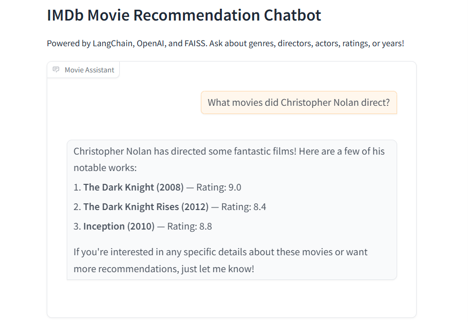
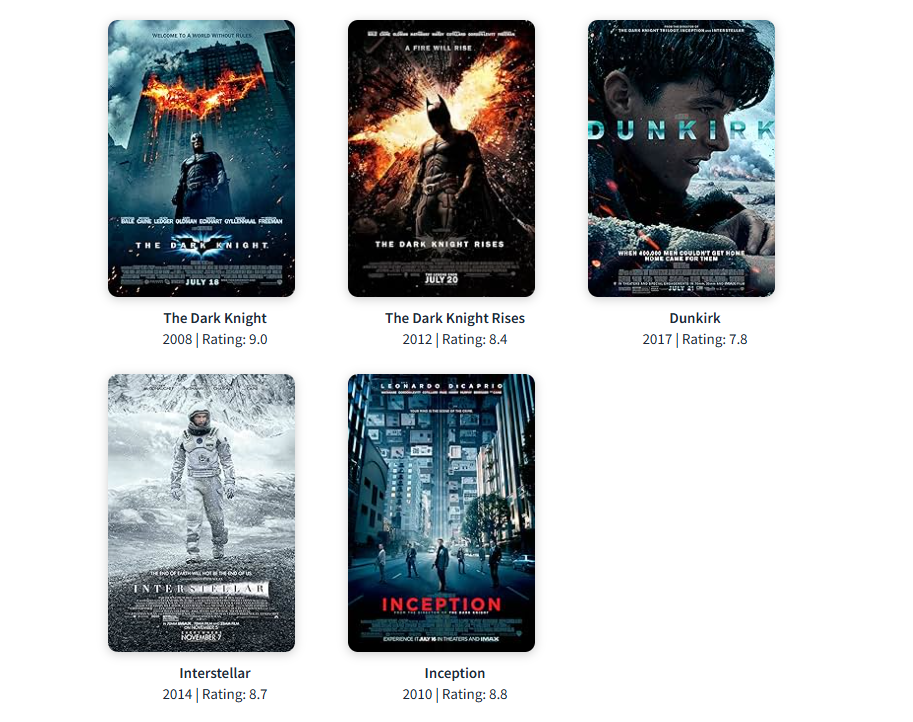
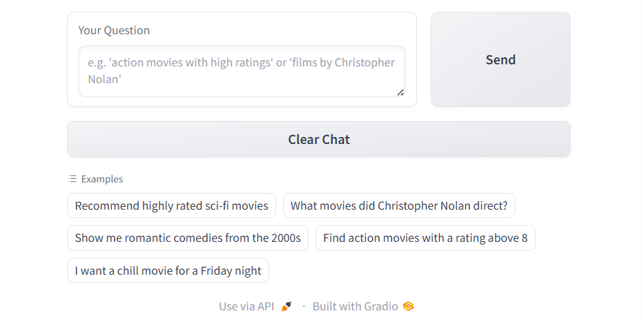

# IMDb Movie Recommendation Chatbot

An AI-powered conversational movie recommendation system built with LangChain, OpenAI, FAISS, and Gradio.

---

## Overview

Finding the right movie to watch is harder than it should be. This project turns a 3,173-film IMDb dataset into a semantic search chatbot that understands natural-language queries — "chill sci-fi for a Friday night" or "films directed by Christopher Nolan" — and responds with relevant recommendations, ratings, and movie posters.

---

## Features

- **Natural-language search** — ask in plain English, not keyword filters
- **Semantic similarity** via FAISS + OpenAI embeddings (`text-embedding-3-small`)
- **Multi-agent orchestration** — five specialised LangChain tools (genre, director, actor, rating, year)
- **Poster display** — movie artwork rendered directly in the chat UI
- **Conversational memory** — chat history preserved within a session
- **Gradio web UI** — no front-end code required; runs in any browser

---

## Architecture

```
IMDb CSV (3,173 movies)
        │
        ▼
  Data Cleaning
  (Star Cast parsing, description generation)
        │
        ▼
  OpenAI Embeddings
  (text-embedding-3-small, 1536-dim vectors)
        │
        ▼
  FAISS Vector Store  ──── saved to faiss_index/
        │
        ▼
  LangChain Retriever (top-5 similarity search)
        │
  ┌─────┴─────────────────────────────────┐
  │         LangGraph ReAct Agent         │
  │  ┌──────────────────────────────────┐ │
  │  │  search_movies_by_genre          │ │
  │  │  search_movies_by_director       │ │
  │  │  search_high_rated_movies        │ │
  │  │  search_movies_by_actor          │ │
  │  │  search_movies_by_year_range     │ │
  │  └──────────────────────────────────┘ │
  │         gpt-4o-mini (orchestrator)    │
  └───────────────────┬───────────────────┘
                      │
                      ▼
              Gradio Chat UI
          (response + poster grid)
```

---

## Tech Stack

| Layer | Technology |
|---|---|
| Embeddings | OpenAI `text-embedding-3-small` |
| Vector store | FAISS (Facebook AI Similarity Search) |
| LLM | OpenAI `gpt-4o-mini` |
| Orchestration | LangGraph `create_react_agent` |
| RAG chain | LangChain LCEL (Runnable) |
| UI | Gradio Blocks |
| Data | pandas, numpy |
| Config | python-dotenv |

---

## Project Structure

```
movie-recommendation-chatbot/
├── app.py               # Gradio UI + agent + retrieval chain
├── build_index.py       # One-time script: CSV → FAISS index
├── requirements.txt     # Pinned dependencies
├── .env.example         # Environment variable template
├── .gitignore
│
├── config/
│   ├── __init__.py
│   └── settings.py      # Loads .env, exposes constants
│
├── data/                # Place imdb_movies.csv here (not committed)
├── faiss_index/         # Generated by build_index.py (not committed)
└── screenshots/         # UI screenshots for README
```

---

## Installation

```bash
# 1. Clone the repository
git clone https://github.com/your-username/movie-recommendation-chatbot.git
cd movie-recommendation-chatbot

# 2. Create and activate a virtual environment
python -m venv venv

# Windows
venv\Scripts\activate

# macOS / Linux
source venv/bin/activate

# 3. Install dependencies
pip install -r requirements.txt
```

---

## Environment Variables

Copy `.env.example` to `.env` and fill in your key:

```bash
cp .env.example .env   # macOS / Linux
copy .env.example .env  # Windows
```

```
OPENAI_API_KEY=sk-...
```

Get your key from [platform.openai.com](https://platform.openai.com/api-keys).

---

## Dataset Setup

1. Download or obtain `IMDb_Dataset.csv`
2. Rename it to `imdb_movies.csv`
3. Place it in the `data/` folder

The CSV must contain these columns:

| Column | Type | Description |
|---|---|---|
| Title | string | Movie title |
| IMDb Rating | float | IMDb score (0–10) |
| Year | int | Release year |
| Certificates | string | Age certificate |
| Genre | string | Primary genre |
| Director | string | Director name |
| Star Cast | string | Concatenated actor names |
| MetaScore | float | Metacritic score |
| Poster-src | string | IMDb poster URL |
| Duration (minutes) | float | Runtime |

---

## Build the FAISS Index

Run this **once** before launching the app. It reads the CSV, creates embeddings, and saves the vector store locally.

```bash
python build_index.py
```

Expected output:
```
Loading dataset from data/imdb_movies.csv...
Loaded 3173 movies.
Cleaning Star Cast field...
Building movie descriptions...
Converting to LangChain documents...
Created 3173 documents.
Creating OpenAI embeddings model...
Building FAISS vector store (this may take 1-2 minutes)...
FAISS index built — 3173 vectors stored.
Saving index to faiss_index/...
Done! FAISS index saved successfully.
```

---

## Run the App

```bash
python app.py
```

Open the local URL printed in the terminal (usually `http://127.0.0.1:7860`).

---

## Example Queries

```
Recommend highly rated sci-fi movies
What movies did Christopher Nolan direct?
Show me romantic comedies from the 2000s
Find action movies with a rating above 8
I want a chill movie for a Friday night
Horror films with high IMDb ratings
Movies starring Meryl Streep
Animated films from 2010 to 2020
```

---

## Screenshots

**Chat response — director search**


**Movie poster grid**


**Full UI — input, examples, and footer**


---

## Skills Demonstrated

- **Retrieval-Augmented Generation (RAG)** — grounding LLM responses in a real dataset
- **Vector embeddings** — semantic similarity search beyond keyword matching
- **LangGraph agent orchestration** — routing queries to specialised tools
- **LangChain LCEL** — composable pipeline construction with Runnables
- **FAISS** — efficient approximate nearest-neighbour search at scale
- **Gradio** — rapid ML UI prototyping
- **Data cleaning** — regex-based parsing of malformed concatenated strings
- **Python packaging** — virtual environments, `.env` management, dependency pinning

---

## Future Improvements

- Add conversation memory so follow-up questions reference earlier turns
- Filter by multiple criteria simultaneously (e.g. genre + year + minimum rating)
- Integrate a live IMDb / TMDB API for up-to-date data
- Deploy to Hugging Face Spaces for a public demo
- Add a "surprise me" random recommendation mode
- Support multi-language queries

---

## Lessons Learned

- Star Cast data was stored as concatenated names with no delimiter; a capital-letter boundary algorithm successfully separated ~97% of entries.
- LangChain's LCEL pipeline makes it straightforward to swap components (retriever, prompt, model) independently.
- Pinning exact dependency versions matters — LangChain's API changed significantly between 0.1.x, 0.2.x, and 0.3.x.
- FAISS serialisation requires `allow_dangerous_deserialization=True` when loading, which is safe for locally-generated index files.
